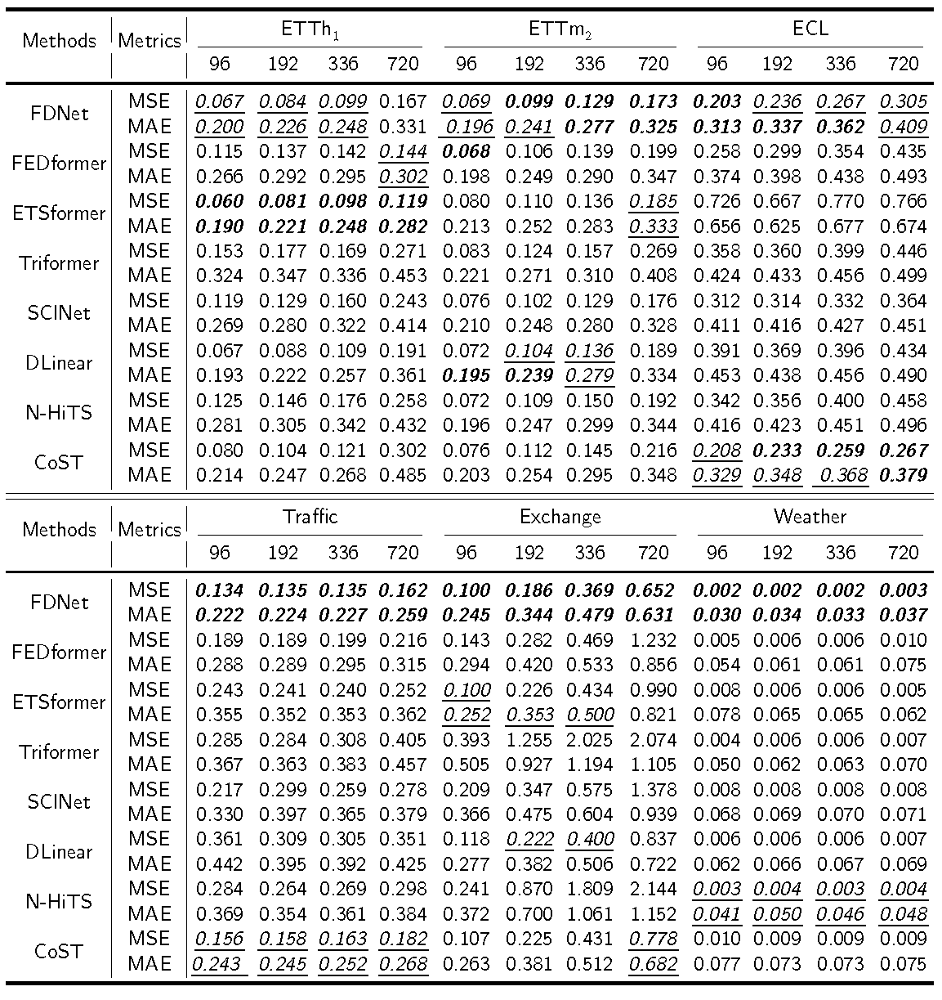

# FDNet: Focal Decomposed Network for Efficient, Robust and Practical Time Series Forecasting


This is the origin Pytorch implementation of FDNet in the following paper: 
[FDNet: Focal Decomposed Network for Efficient, Robust and Practical Time Series Forecasting] (Manuscript submitted to IP&M).

## Decomposed Forecasting Formula
It is different from existing multi-step and one-step forecasting formulas are illustrated Figure 1. Built upon one-step forecasting formula where forecasting processes of prediction elements are decomposed, decomposed forecasting formula further decomposes feature extraction processes of input elements. Hence, FDNet is composed of basic MLPs to extract local fine-grained feature maps of input sequence and canonical convolutions to stabilize feature extraction processes when handling outliers of input sequences.
<p align="center">

<br><br>
<b>Figure 1.</b> Connections and differences among three forecasting formulas. Correlations of prediction elements are neglected by one-step forecasting formula while universal correlations of input elements are further neglected by our proposed decomposed forecasting formula.
</p>

## Focal Input Sequence Decomposition
How focal input sequence decomposition works with forecasting networks is depicted in Figure 2. The latest sub-sequence of input sequence has the shortest length but has the most feature extraction layers. When it goes to farther regions, decomposed sub-sequence gets longer and feature map extracted from it gets shallower. Proportions of input sequence comprised by different sub-sequences approximately form a geometric series with common ratio of α. We set α to 0.5 throughout following sections and experiments. In fact, α could be set to other positive numbers which are smaller than one, however these make no difference to the essence of focal decomposition. The number of input sub-sequences divided by focal input sequence decomposition method is a hyper-parameter denoted by *f*. For instance, if input sequence is consecutively splitted into 4 parts by focal decompostion method like Figure 2, then proportions will be \{1/2, 1/4, 1/8, 1/8\}. The latest sub-sequence takes the proportion of 1/8 instead of 1/16 in order to make the sum of proportions be 1. Furthermore, feature extractions of different sub-sequences and projections of them to output prediction sequence are all mutually independent. As a result, focal input sequence decomposition method effectively allocates complexity levels to different input sub-sequence independently according to their temporal distances with prediction sequence. Networks with focal input sequence decomposition method is now able to deal with LSTI problem without gaining considerable parameters and suffering performance drop with prolonging the input sequence length. When combining FDNet with focal input sequence decomposition, decomposed feature extraction layers in Figure 3 will take formats in Figure 2.\par
<p align="center">

<br><br>
<b>Figure 2.</b>  The architecture of focal input sequence decomposition. Final representations of different sub-sequences are from temporally close to far; short to long; deep to shallow.
</p>

<p align="center">

<br><br>
<b>Figure 3.</b> An overview of the architecture of FDNet. It decomposes feature extraction processes of different input elements and different variates. Its main components are N decomposed feature extractor layers (blue trapezoid), each containing four 2D convolutional layers. Weight Normalization, Gelu activation and res-connection are combined with each 2D convolutional layer.
</p>

## Requirements

- Python 3.8
- matplotlib == 3.1.1
- numpy == 1.19.4
- pandas == 0.25.1
- scikit_learn == 0.21.3
- torch == 1.11.0

Dependencies can be installed using the following command:
```bash
pip install -r requirements.txt
```

## Data

ETT, ECL, Traffic, Exchange and weather datasets were acquired at: [datasets](https://drive.google.com/drive/folders/1ZOYpTUa82_jCcxIdTmyr0LXQfvaM9vIy?usp=sharing). 

## Usage
Commands for training and testing FDNet of all datasets are in `./scripts/FDNet.sh`.

More parameter information please refer to `main.py`.

We provide a complete command for training and testing FDNet:

```
python -u main.py --model <model> --data <data> --root_path <root_path> --features <features> --label_len <label_len> --pred_len <pred_len> --pyramid <pyramid> --attn_nums <attn_nums> --d_model <d_model> --kernel <kernel> --criterion <criterion> --learning_rate <learning_rate> --dropout <dropout> --batch_size <batch_size> --train_epochs <train_epochs> --itr <itr>
```

Here we provide a more detailed and complete command description for training and testing the model:

| Parameter name | Description of parameter |
|:---:|:---:|
| model | The model of experiment. This can be set to `FDNet` |
|      data      | The dataset name  |
|   root_path    | The root path of the data file  |
|   data_path    | The data file name  |
|    features    |The forecasting task. This can be set to `M`,`S` (M : multivariate forecasting, S : univariate forecasting |
|     target     |  Target feature in `S` task   |
|  checkpoints   | Location of model checkpoints |
| label_len |Input sequence length |
| pred_len | Prediction sequence length |
| enc_in | Input size |
| c_out | Output size  |
| d_model | Dimension of model |
| dropout | Dropout  |
|kernel|The kernel size |
|criterion|Standardization|
| itr | Experiments times |
| train_epochs | Train epochs of the second stage |
| batch_size | The batch size of training input data |
| patience | Early stopping patience  |
| learning_rate | Optimizer learning rate |
| pyramid |The number of input sub-sequences with different sequence lengths divided by focal input sequence decomposition method  |
| attn_nums | The number of decomposed feature extraction layers |
|ICOM|Whether combine forecasting formula with ICOM|
| loss | Loss function |


## Results

The experiment parameters of each data set are formated in the `FDNet.sh` files in the directory `./scripts/`. You can refer to these parameters for experiments, and you can also adjust the parameters to obtain better mse and mae results or draw better prediction figures.

<p align="center">

<br><br>
<b>Figure 4.</b> Multivariate forecasting results
</p>

<p align="center">

<br><br>
<b>Figure 5.</b> Univariate forecasting results
</p>


## Contact
If you have any questions, feel free to contact Li Shen through Email (shenli@buaa.edu.cn) or Github issues. Pull requests are highly welcomed!
